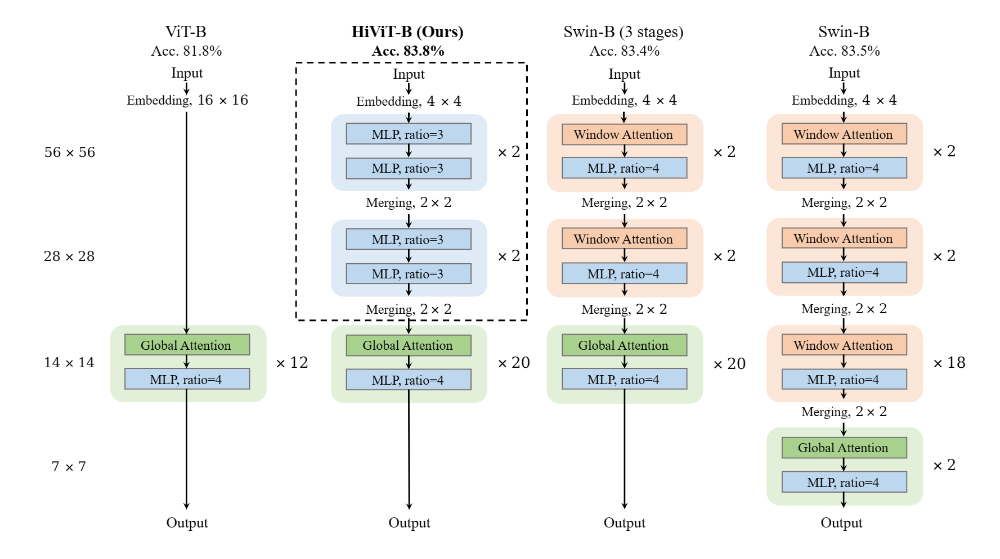

# HiViT (ICLR2023, notable-top-25%)

<div align=center></div>

This is the official implementation of the paper [HiViT: A Simple and More Efficient Design of Hierarchical Vision Transformer](https://arxiv.org/abs/2205.14949). 

## Results

| Model       | Pretraining data  | ImageNet-1K | COCO Det | ADE Seg |
| ----------- | ----------------  | :---------: | :------: | :-----: |
| MAE-base    | ImageNet-1K       | 83.6        | 51.2     | 48.1    |
| SimMIM-base | ImageNet-1K       | 84.0        | 52.3     | 52.8    |
| HiViT-base  | ImageNet-1K       | 84.6        | 53.3     | 52.8    |

## Pre-training Models

[mae_hivit_base_1600ep.pth](https://drive.google.com/file/d/1VZQz4buhlepZ5akTcEvrA3a_nxsQZ8eQ/view?usp=share_link)

[mae_hivit_base_1600ep_ft100ep.pth](https://drive.google.com/file/d/1TVfocCnoJj-SB7to6UQFvrB2205u2Q59/view?usp=share_link)

## Usage
> **1. Supervised learning on ImageNet-1K.**: See [supervised/get_started.md](supervised/get_started.md) for a quick start.

> **2. Self-supervised learning on ImageNet-1K.**: See [self_supervised/get_started.md](self_supervised/get_started.md).

> **3. Object detection**: See [detection/get_started.md](detection/get_started.md).

> **4. Semantic segmentation**: See [segmentation/get_started.md](segmentation/get_started.md).

## Bibtex
Please consider citing our paper in your publications if the project helps your research.  
```bibtex
@inproceedings{zhanghivit,
  title={HiViT: A Simpler and More Efficient Design of Hierarchical Vision Transformer},
  author={Zhang, Xiaosong and Tian, Yunjie and Xie, Lingxi and Huang, Wei and Dai, Qi and Ye, Qixiang and Tian, Qi},
  booktitle={International Conference on Learning Representations},
  year={2023},
}
```
